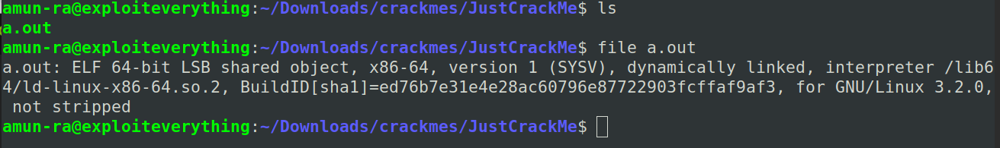
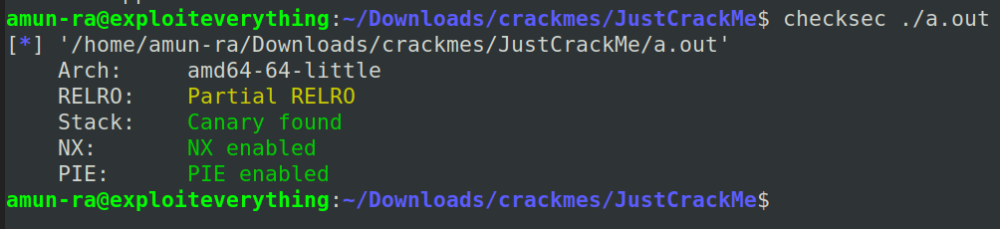
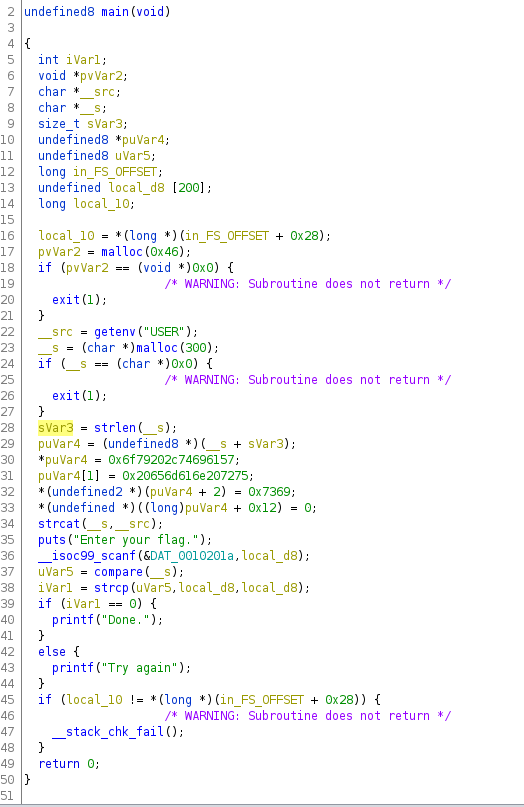
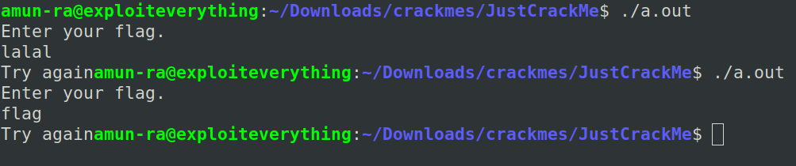
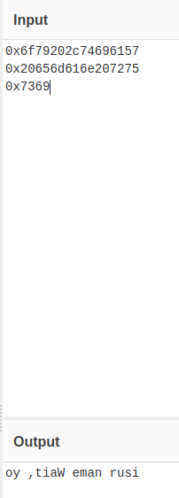
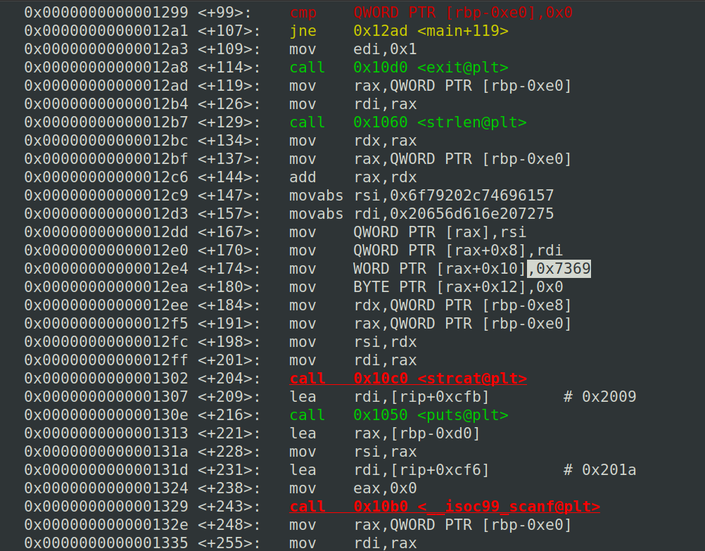
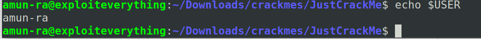
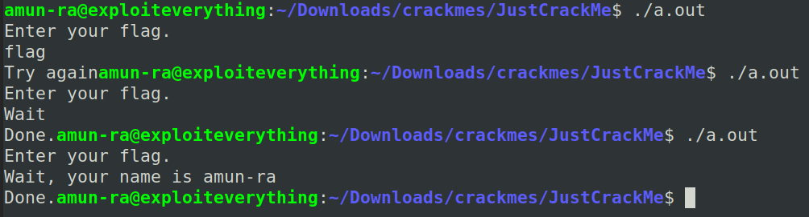

# JustCrackMe Writeup

Lets unzip the binary

Check its type

It is not-stripped

Lets check it using checksec

No way that we can use stack here

So lets play with code

Decompile it in Ghidra

The main() function of the program is

Lets try running the program

It seems like this compares the input and returns the printf statement

So the comapred string is our flag here

As you can see, here the pointer puVar4 contains some hex data

Lets decompile it

We can say it is stored in little endian

Now,

oy, tiaW ---> Wait, yo
eman ru  ---> ur name
si       ---> is

So the string stored in puVar4 is
"Wait, your name is"

It is being concatenated with "USER" variable using getenv()

So the actual value of the flag should be

puVar4+username

Lets try passing it,

LOL,Its trying to comapre the each value of the pointer with the flag

But the actual flag from code is the last input