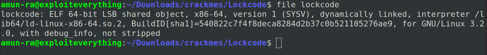
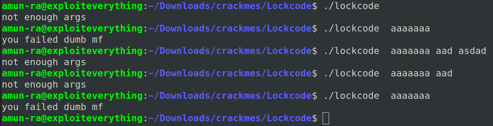
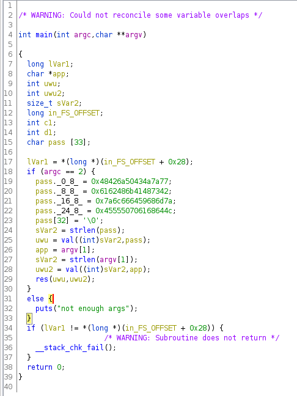
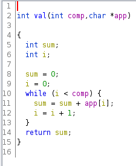
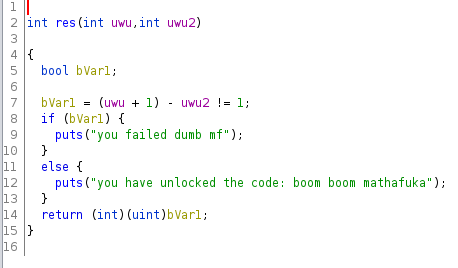
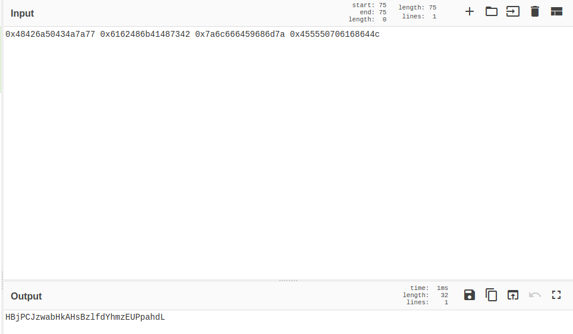
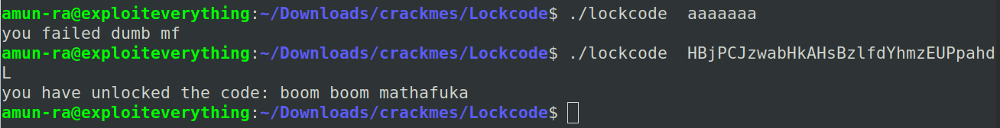

# LOCKCODE - WRITEUP

Download and extract the file

Check the file

Lets check it with "checksec"

So there is nothing in stack that we can do

We have to play with the program in this situation

Lets check the program how it works

We can clearly say that it takes only one argument

But we dont know what this program does with that argument

So lets decompile the binary in Ghidra

We can see there are three functions

main(),res(),val()

Now after analyzing the val() it justs comapres the value of the input same as the string defined in the program

res(),justs prints the statement

Now lets decode the string which is stored as hex

Passing the string as input

We cracked the binary

