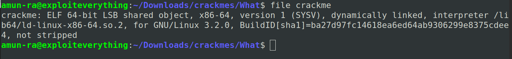
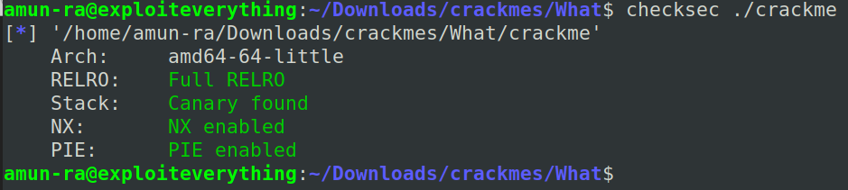
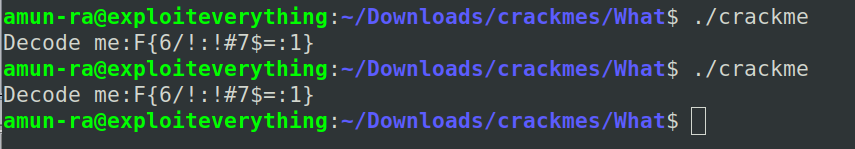
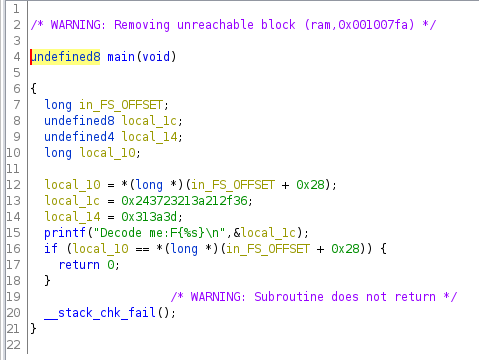
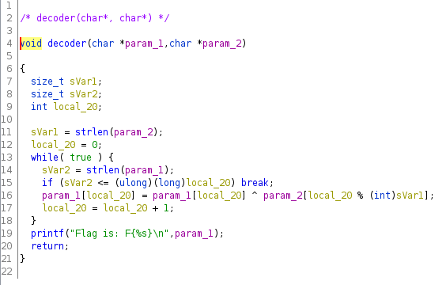
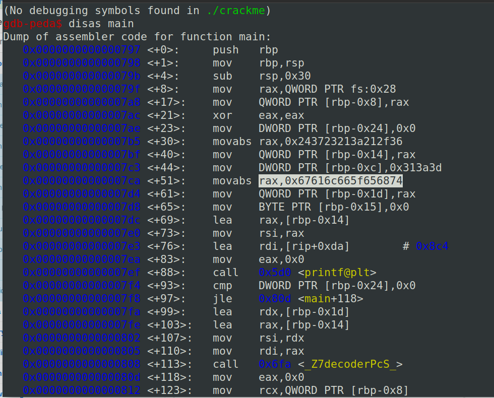
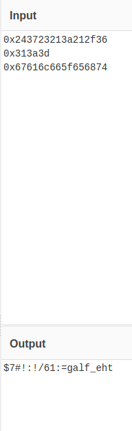
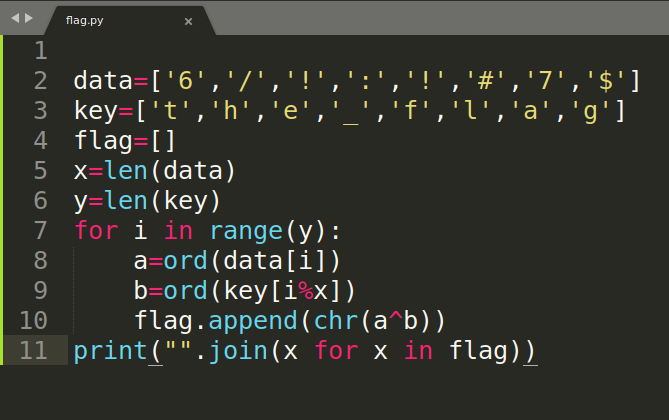
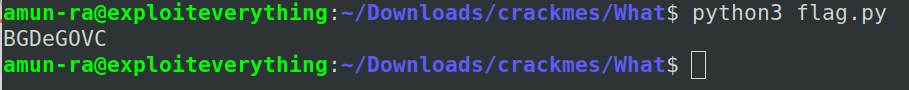

# WHAT WRITEUP

Lets download and unzip the binary

On checking its file type, 

We can see it is a not-stripped binary,

So we can read the symbols

Using checksec

Now we cannot use the stack

We have to deal with the code only

By running it,

We can see it prints only one fixed output

Decompiling it in Ghidra

We can see the main() function

It always prints an output which is fixed and it also has some values stored in variables

So lets search for other functions

We got decoder() function

It seems like a flag decoder function

It uses XOR operation for two strings

We need to find that two strings

Now analysing the ASM of main() in GDB

Here we can see 3 input values are being stored,

(But we saw only 2 while decompiling)

Decoding the Hex values

We can see that the last value in hex is decoded as(little endian)

"the_flag"

So our first string is the encoded output displayed

And the second string may be "the_flag"

Now passing this in decoder(),

I wrote it in Py

Pass the strings in reverse order since it is stored as little endian in stack

Lets run it to get the flag

